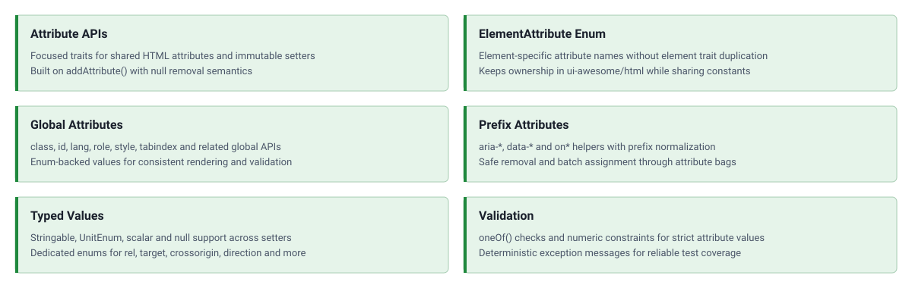

<!-- markdownlint-disable MD041 -->
<p align="center">
    <a href="https://github.com/ui-awesome/html-attribute" target="_blank">
        
    </a>
    <h1 align="center">Html Attribute</h1>
    <br>
</p>
<!-- markdownlint-enable MD041 -->

<p align="center">
    <a href="https://github.com/ui-awesome/html-attribute/actions/workflows/build.yml" target="_blank">
        
    </a>
    <a href="https://dashboard.stryker-mutator.io/reports/github.com/ui-awesome/html-attribute/main" target="_blank">
        
    </a>
    <a href="https://github.com/ui-awesome/html-attribute/actions/workflows/static.yml" target="_blank">
        
    </a>
</p>

## Features

<picture>
    <source media="(max-width: 767px)" srcset="./docs/svgs/features-mobile.svg">
    
</picture>

<p align="center">
    <strong>A focused library for building and rendering structured HTML attributes</strong><br>
    <em>Type-safe helpers and value objects to compose complex attribute structures (classes, data-attributes, ARIA, etc.).</em>
</p>

### Installation

```bash
composer require ui-awesome/html-attribute:^0.6
```

### Quick start

Compose reusable attribute APIs by combining the package traits with the immutable attribute mixin.

```php
<?php

declare(strict_types=1);

namespace App;

use UIAwesome\Html\Attribute\Global\{HasClass, HasData, HasId};
use UIAwesome\Html\Attribute\HasRel;
use UIAwesome\Html\Attribute\Values\Rel;
use UIAwesome\Html\Helper\Attributes;
use UIAwesome\Html\Mixin\HasAttributes;

final class LinkAttributes
{
    use HasAttributes;
    use HasClass;
    use HasData;
    use HasId;
    use HasRel;

    public function render(): string
    {
        return Attributes::render($this->getAttributes());
    }
}

$attributes = (new LinkAttributes())
    ->id('documentation')
    ->class('nav-link')
    ->class('is-active')
    ->rel(Rel::NOOPENER)
    ->addDataAttribute('tracking', 'docs');

echo '<a' . $attributes->render() . ' href="/docs">Documentation</a>';
```

### Documentation

For detailed configuration options and advanced usage see:

- 🧪 [Testing Guide](docs/testing.md)

## Package information

[](https://www.php.net/releases/8.3/en.php)
[](https://packagist.org/packages/ui-awesome/html-attribute)
[](https://packagist.org/packages/ui-awesome/html-attribute)

## Quality code

[](https://codecov.io/github/ui-awesome/html-attribute)
[](https://github.com/ui-awesome/html-attribute/actions/workflows/static.yml)
[](https://github.com/ui-awesome/html-attribute/actions/workflows/linter.yml)
[](https://github.styleci.io/repos/767435734?branch=main)

## Our social networks

[](https://x.com/Terabytesoftw)
[](https://www.facebook.com/wilmer.arambula.9)

## License

[](LICENSE)
